This Folder Contains all files related to Part 1 of my project 
5.2  Download Requirements 
The Following packages and applications need to be installed:
	- Jupyter Notebook
	- Python > 3.10 and the following packages:
			Open CV (cv2), numpy, sklearn, tensorflow, matplotlib, seaborn, 
MobileNetV3, ResNet50, VVG16
JAVA Script
PYTHON FLASK 

{5.3 User Manual 
Accessing the Research materials 
All files for the research part of the project are located in the "Part-1 (Research)" folder of the submission. The folder contains the following subfolders and files:
Dataset: This folder contains two subfolders:
"original": Contains the original dataset of images.
"Augmented5x": Contains the images produced using the original dataset through augmentation.
DataProcessingFolder: Contains Python scripts in Jupyter Lab notebook format for preprocessing the dataset, including augmentation, contrast increase, cropping, and splitting the dataset.
Framework 1 - PCA Models: Contains Jupyter Lab notebook files for the PCA models.
Framework 2 - TransferLearning Models: Contains Jupyter Lab notebook files for the Transfer Learning models.
Framework 3 - CNNmain Model: Contains Jupyter Lab notebook files for the CNN model.
SavedModels: Contains all the final models obtained from the research in Part 1, in .h5 and .pkl formats.

All Jupyter notebooks have outputs already showing, including the results from testing the models, how the dataset was processed and trained, the hyperparameters used, and graphs and other illustrations.

Accessing the different webpages of the Web Application 

All files related to the development of the web application "Automatic Autism Diagnosis using Eye Tracking and Machine Learning" are present in the "Part-2(Web Application)" folder. The folder contains the following subfolders and files:

Webpage-1 EyeTracking Webpage: Contains the main.html file for the eye tracking webpage. To access this webpage, double-click the "1_EyeTrackingWebpage" HTML shortcut or navigate to the main.html file in the subfolder. Follow these steps to use the webpage:
Click "Begin Tracking" and grant camera permission. A video preview of the webcam should appear on the top left side of the screen, and a moving red dot should indicate where the user is looking.
Click "Calibrate" to calibrate the eye tracking. A window overlay with red dots will appear. Click each button until it turns green, then close the overlay with the cross button in the top left corner.
Click "Begin Recording" to start saving eye tracking data in a CSV file.
Use the "Toggle Video Preview" button to enable or disable the video preview.
Adjust the "Sampling Minimum Delay" slider from 0ms to 5000ms to introduce a sampling rate delay. Click "Apply" to apply the changes.
Use the "Pause Tracking" and "Resume Tracking" buttons to pause and resume eye tracking.
Click "Save" to stop recording and download the CSV file.
Use the dropdown list to choose from regression models for eye tracking. Click "Apply" to apply the selected model.
Click "Visualize Eye Tracking" in the top right corner to navigate to the next page.

 Webpage-2 EyeTracking Visualisation Webpage: Contains the index.html file for the eye tracking visualization webpage. To access this webpage, double-click the "2_EyeTrackingVisualiserWebpage" HTML shortcut or navigate to the index.html file in the subfolder. Follow these steps to use the webpage:
Click "Choose File" to upload a CSV file of eye tracking data. The CSV should have the format: X, Y, Timestamp.
Set the smoothing level by choosing from the list and clicking "Apply."
The "Original" container shows the eye tracking visualization without smoothing.
Scroll down to see the "Smoothed" container, which shows the eye tracking visualization with smoothing.
Click "Record Eye Tracking" in the top right corner to navigate back to the previous webpage.

Webpage-3 Prediction Webpage: Contains the app.py file for the prediction webpage. To access this webpage, double-click the "3_PredictionWebpage" Python shortcut or navigate to the app.py file in the subfolder. A console window should appear, starting the Python Flask local server. Navigate to the URL shown in the console window (usually http://127.0.0.1:5000/). Follow these steps to use the webpage:
Use the "Select a Model" dropdown list to choose a pretrained model.
(Optional) Click "Upload your Own Model" to upload a deep learning model.
(Optional) Set class names by filling in the "Class 0 Name" and "Class 1 Name" text fields.
Click "Upload an Image" to upload the eye tracking visualization image for prediction.
Click "Run Prediction" to run the prediction. The predicted results will appear at the bottom of the webpage.

Webpage-4 Model Training Webpage: Contains the app.py file for the model training webpage. To access this webpage, double-click the "4_ModelTrainingWebpage-A" Python shortcut or navigate to the app.py file in the subfolder. A console window should appear, starting the Python Flask local server. Make sure to close the console from the previous webpage to avoid conflicting servers on the same URL. Navigate to the URL shown in the console window (usually http://127.0.0.1:5000/). Follow these steps to use the webpage:
In the "Select Dataset" section, click "Choose File" and select a dataset in ZIP format. Click "Upload" to upload the file. The ZIP file should contain a folder named "dataset" with two subfolders containing images of their respective classes.
(Optional) Click "Choose File" and select a model in .h5 format to upload your own model. Click "Upload" to upload the file.
Choose a model from the list of models in the "Select Model" section.
Set the number of epochs for training in the "Epochs" number field.
Click "Start Training" to begin the training process. The progress and training metrics can be viewed in the console window of the Python Flask app.
After the training process is complete, a "Download Retrained Model" button will appear to download the retrained model.

Abstract

This project explores the potential of using machine learning with gaze-tracking technology in the early identification of autism spectrum disorder. The study is divided into two parts, research work , and software development. Part 1 used a dataset comprising gaze-tracking information mapped onto images to differentiate between control subjects and autistic individuals. Two machine learning frameworks were employed for model training: (1) a fast approach using principal component analysis (PCA) on the images followed by machine learning algorithms such as support vector machines (SVM), which yielded an accuracy of 78% and an AUC of 0.82; and (2) a deep learning approach that involved a custom convolutional neural network (CNN) model, achieving an accuracy of 92% and an AUC of 0.96. Several transfer learning models were also evaluated, with the ResNet50 model providing the best results (accuracy: 0.86, AUC: 0.94). These findings demonstrate the viability of these methods for the pre-diagnosis of autism. In Part 2, a prototype web app was developed to run predictions on new data and facilitate researchers in gathering new datasets without requiring costly equipment. This tool enables researchers to train their models, promoting further advancements in the field. By providing an accessible platform for data collection and model training, the software empowers the research community to continue refining and improving autism diagnosis methods using eye-tracking technology.

**Table of contents**

**Abstract**

1. **Part 1 - Research Work…………………………………………………………………….5**
1. **Introduction……………………………………………………………………………..5**
1. **Literature review ………………………………………………………………………6**
1. **Data set7**

**1.3.1 Image Augmentation……………………………………………………….9**

4. **Framework 1 …………………………………………………………………………. 9**
   1. **Methodology ………………………………………………………………..9**
   1. **Principal Component Analysis …………………………………………10**
   1. **Support Vector Machine …………………………………………………11**
   1. **Decision Jungle …………………………………………………………...11**
   1. **Artificial Neural Networks………………………………………………. 12**
   1. **Experimentation and Results …………………………………………..12**
4. **Framework 2 ………………………………………………………………………….14**
   1. **Methodology ……………………………………………………………….14**
   1. **CNN ………………………………………………………………………….15**
   1. **CNN Architecture …………………………………………………………16**
   1. **Transfer learning:VVG16, MobileNetV3,ResNet50 ………………….17**
   1. **Experimentation and Results …………………………………………..17**
4. **Analytical Comparison Framework 1 and 2 …………………………………….21**
4. **Conclusion to Part one ……………………………………………………………..21**
2. **Part 2 - Web App Development ………………………………………………………...23**
   1. **Overview and Problem Description ………………………………………………23**
   1. **High-Level Structure of the Web Application …………………………………..24**

      3. **EyeTracking Web Page …………………………………………………………….25**
         1. **Page Layout and User Interactions …………………………………...25**
         1. **Webgazer.JS Library …………………………………………………….27**
         1. **Functional Requirements ………………………………………………..27**
         1. **UML Diagrams ……………………………………………………………..28**
         1. **Webpage Components …………………………………………………..29**
   1. **EyeTracking Image Visualisation Webpage……………………………………..30**
      1. **Page Layout and User Interactions ……………………………………30**
      1. **Visualisation Smoothening ……………………………………………..32**
      1. **Functional Requirements ………………………………………………..32**
      1. **UML Diagrams ……………………………………………………………..33**
      1. **Webpage Components………………………………………………….. 34**
   1. **Prediction Webpage …………………………………………………………………35**
1. **Launching the webpage …………………………………………………35**
1. **Page Layout and User Interactions ……………………………………35**
1. **Functional Requirements ………………………………………………..36**
1. **UML Diagrams ……………………………………………………………..38**

   5. **Webpage Components ………………………………………………….39**
6. **Model Retraining Website …………………………………………………………40**
1. **Launching the webpage …………………………………………………41**
1. **Page Layout and User Interactions ……………………………………41**
1. **Functional Requirements ………………………………………………43**
1. **UML Diagrams ……………………………………………………………44**
1. **Web Page Components …………………………………………………45**
3. **Conclusion ………………………………………………………………………………..47**
3. **Reflection ………………………………………………………………………………….47**
3. **Future Work ……………………………………………………………………………….48**
3. **Appendix………………………………………………………………………………… 50**
1. **Acknowledgement …………………………………………………………50**
1. **Download Requirements ………………………………………………….50**
1. **User Manual For Web Application ……………………………………….50**
1. **Project timeline ……………………………………………………………...54**
1. **References ……………………………………………………………………54**
1. **Part 1 (Research work)**
1. **Introduction**

Autism Spectrum Disorder, a complex neurodevelopmental condition causing difficulties with social interaction, communication, and repetitive behaviors, demands early diagnosis and intervention for better outcomes, including specialized treatment and support that can enhance quality of life. The availability of skilled professionals frequently limits today's diagnostics, that often must rely on expert assessments that can be time-consuming and random. Thus, quantitative, objective, and powerful analytic approaches are in high demand. The goal is to discover autism early, in order to transform the lives of those affected and their families.

Eye tracking technology, which captures and analyzes gaze patterns, has shown potential in differentiating individuals with autism from typically developing individuals. Research suggests that the gaze patterns of individuals with ASD exhibit distinct characteristics, reflecting the unique social and cognitive processing of this population. Using eye-tracking data, the aim is to create new diagnostic methods to differentiate between autistic and control subjects through the application of machine learning models. By overcoming the shortcomings of current methods, it should have the potential to advance in the field and explore innovative techniques.

The importance of this project lies in its potential to aid in the early identification of ASD, which will subsequently improve access to early intervention and support. The research can also assist in reducing the subjectivity associated with current diagnostic procedures, leading to more accurate and reliable diagnoses, by developing a data-driven and objective diagnostic tool.

The report is divided into two parts: Part 1 focuses on model training and research, wherein a dataset of gaze-tracking information is mapped onto images to differentiate between control subjects and autistic individuals. Two machine learning frameworks are trained and compared - a fast approach using principal component analysis (PCA) and support vector machines (SVM), and a deep learning approach employing a custom convolutional neural network (CNN) model and transfer learning models. The results highlight the viability of these methods for pre-diagnosing autism.

Part 2, presents the development of a prototype web application aimed at researchers, designed to facilitate the collection of new eye-tracking data, running predictions on new data, and retraining models. This user-friendly platform not only assists researchers in gathering new datasets without requiring expensive equipment but also provides them with the tools to train and refine their own models, fostering further advancements in the field of autism diagnosis using eye-tracking technology.

By examining the potential of gaze tracking data in the early diagnosis of autism and providing a platform for ongoing research, this report contributes to the development of innovative, objective, and efficient diagnostic tools that can improve the lives of individuals with ASD and their families.

2. **Literature review**

Various studies have been conducted to explore the potential of eye-tracking technology in diagnosing autism.

(Klin et al., 2002) investigated the visual fixation patterns of individuals with autism while they viewed naturalistic social situations. The researchers found that the gaze patterns of autistic individuals differed significantly from those of typically developing individuals, suggesting that eye-tracking technology could be used to identify autism.

(Nayar et al., 2022) utilized eye-tracking technology to study the gaze patterns of toddlers with autism spectrum disorder during a dynamic social interaction. Their findings indicated that autistic toddlers demonstrated reduced monitoring of social situations, further emphasizing the potential for eye tracking in autism diagnosis.

(Chita-Tegmark, 2016) conducted a review and meta-analysis of eye-tracking studies focused on attention allocation in individuals with an autism spectrum disorder. The review highlights the differences in gaze patterns between individuals with ASD and typically developing individuals, emphasizing the potential of eye-tracking technology for an autism diagnosis.

(Tao & Shyu, 2019) proposed a framework called SP-ASDNet for autism screening based on gaze scan paths. They used a CNN-LSTM architecture to extract features from the saliency map and achieved an accuracy of 74.22% on the validation dataset. In contrast, (Carette et al., 2018) employed an LSTM-RNN-based ML classifier on eye-tracking data from children aged 8 to 10 and achieved an average accuracy of over 90%. However, they acknowledged the possibility of model overfitting due to the small dataset.

More recently, (Oliveira et al., 2021) collected eye-tracking data from 106 subjects using Tobii Pro TX300 equipment. They used a genetic algorithm to identify ASD-relevant features and tested two classifiers, SVM and ANN. The SVM model scored an AUC of 77.5%, while the ANN model achieved an AUC of 82.2%. Despite the promising results, the authors encountered challenges in obtaining annotated datasets from experts.

In conclusion, the literature highlights the potential of eye-tracking technology in ASD diagnosis, with various machine-learning models demonstrating promising results. However, a common limitation among these studies is the lack of a comprehensive eye-tracking dataset well suited for machine learning-based research work. Additionally, many authors reported the need for expensive equipment in their research, indicating a potential barrier to the widespread application of these methods. This project aims to address these challenges by developing a more accessible and cost-effective platform for data collection and model training in the field of autism diagnosis using eye-tracking technology.

3. **Dataset**

In this study, a public dataset from research by (Carette et al. 2019) was used that aimed to see if eye-tracking technology could help with early screening of Autism Spectrum Disorder (ASD). The dataset is made for experimenting with eye-tracking in ASD research. The interesting thing about Carette et al.'s approach is that they turned eye-tracking data into images, which means diagnosing ASD can be treated like an image classification task. This creative method allows for using different machine-learning models for image classification in ASD diagnosis.

There were 59 children in the study, and they focused on including young participants to help with the early detection and diagnosis of autism. The subjects were shown a series of autism-related visual stimuli while their eye movements were recorded using an SMI RED eye tracker. To make the images, the researchers took three dynamic components from the eye-tracking data: velocity, acceleration, and jerk. They then put these onto three equal-sized layers that matched the red, green, and blue (RGB) colors of an image. The values of these three components changed the colors in each layer, creating a unique picture

of each child's eye-tracking path.

By using this dataset, the study wants to build on the existing research and further explore how eye-tracking technology and machine learning models can help with early diagnosis of autism spectrum disorder. The summarized important info about the dataset in Table 1, and you can see examples of images from both groups (TD and ASDs) in Figure 1.

|Number of participants|59|
| - | - |
|Gender Distribution M:F|38:21|
|No.of Control subjects|30|
|No.of ASD subjects|29|
|Age ( Mean/median) years|7\.8/8.1|
|CARS Score (Mean)|32\.97|
|Size of Image|640x480x3|
|Total Images|547|
|Images from Ctrl subjects|328|
|Images from ASD subjects|219|

*Table 1.1. Summary of Eyetracking scan path Image dataset*

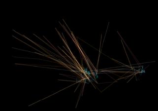 

*Figure 1.1. The visual representation of eye-tracking scan paths. The left-sided image      represents ASD-diagnosed participants, while the right-sided is for non-ASD when given the same Visual Stimuli*

**1.3.1. Image Data Augmentation**

A big challenge faced during this study was the limited amount of data available for training the model. To tackle this issue and lower the risk of overfitting, image data augmentation was used, which is a common method to increase dataset size and enhance model generalization.

In this study, data augmentation was applied to create variations of the eye-tracking scan path visualizations. Starting with an initial dataset of 547 images, an additional 2,735 samples were generated, making five synthetic images for each original visualization. This process effectively increased the dataset size by five times, providing a stronger foundation for training the machine learning models.

A straightforward Python script was created to carry out the data augmentation, performing various image transformations like zooming, shearing, and rotation. By creating these synthetic variations, the goal was to make a more diverse dataset that would help the models better understand the patterns in the eye-tracking scan paths. Ultimately, this should lead to improved performance in early diagnosis of autism spectrum disorder.

4. **Framework 1**
1. **Methodology**

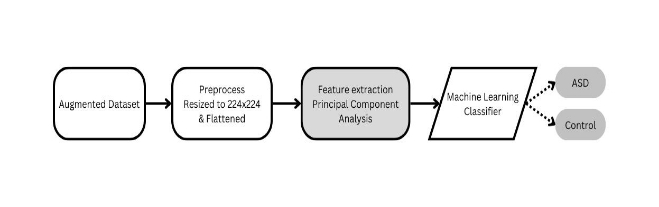

*Figure 1.2. Principal Component Analysis Framework*

The first framework shown in Figure 2 used for model development began with the processing of the augmented image dataset. Initially, the images were resized to a uniform size of 224x224 pixels to expedite processing times. The images were then flattened to create a one-dimensional representation of the pixel values. The next step in the framework was to extract features from the flattened images using Principal Component Analysis (PCA).

2. **Principal component analysis (PCA)**

Principal component analysis (PCA) is a sophisticated statistical technique widely employed for feature extraction and dimensionality reduction in various fields, including image processing, bioinformatics, and finance.

By transforming the high-dimensional image data into a lower-dimensional space, PCA helped mitigate the challenges posed by the curse of dimensionality, such as overfitting and lengthy computation times. The use of PCA allows us to retain the most significant features of the eye-tracking scan path visualizations while reducing the complexity of the dataset, thereby enhancing the performance and interpretability of the machine-learning models. By employing Principal Component Analysis (PCA), the original set of variables can be transformed into a fresh set of independent variables, known as principal components. These chief elements are linear combinations of the initial variables and are arranged in order of the variance they account for. By electing a selection of the principal components that cover the majority of the variance in the information, we can effectively truncate the dimensionality of the dataset while maintaining maximum information. The optimal number of components was determined by examining the explained variance. This allowed us to strike a balance between reducing the dimensionality of the dataset and preserving the most significant features for the machine-learning models.

Once the features were extracted using PCA, various machine learning classifiers were trained and tested, including Random Forest, Logistic Regression, ANNs, Decision Jungle and Support Vector Machines (SVM).

To evaluate and compare the performance of each classifier, several evaluation metrics were employed, such as the Receiver Operating Characteristic (ROC) curve, confusion matrix, accuracy, precision, recall, and F1 score. The SVM classifier and Decision Jungle were chosen based on their performance.

3. **Support Vector Machines**

SVM (Chita-Tegmark, 2016) aims to find the optimal hyperplane that best separates the data points belonging to different classes. The algorithm focuses on maximizing the margin between the nearest data points, called support vectors, and the decision boundary. This approach enhances the model's generalization ability and minimizes the risk of overfitting. In cases where the data is not linearly separable, SVM employs kernel functions, such as polynomial or radial basis function (RBF) kernels, to project the data into a higher-dimensional space where a linear decision boundary can be found.

SVM has several key advantages, including its ability to handle high-dimensional data, its robustness against overfitting, and its capacity to identify complex decision boundaries. Additionally, SVM is particularly effective in scenarios where the number of features is greater than the number of samples, as the model is less likely to overfit. SVM, however, can be delicate to the kernel and its parameter selection, necessitating careful tuning to achieve the best performance. Additionally, the need to solve a quadratic optimization problem may result in longer training times for SVM on large datasets.

4. **Decision Jungle**

The decision jungle (Criminisi & Shotton, 2013) approach uses a number of decision trees and mixes their predictions to get better accuracy and stability. It works by making lots of decision trees, each one trained on a random bit of the input data, with some overlaps. The trees in a Decision Jungle aren't very deep, which makes the model work faster and keeps it from overfitting. When predicting outcomes, the algorithm puts together the outputs of all the trees in the group, often using majority voting or weighted averaging, to get the final answer.

Some great things about Decision Jungle are that it can deal with messy or unbalanced data, it's good at not overfitting, and it can handle complex decision boundaries by putting together a few simple trees. Plus, the algorithm can be split up to work faster on big datasets, and it's easy to understand, which is nice for different uses. On the other hand, Decision Jungle might not do so well if the trees are too shallow or if there isn't enough variety in the group. Also, it can be a bit picky about the hyperparameters you choose, like the number of trees, tree depth, and how you sample the data, so you'll need to be careful with those to get the best results.

**1.4.6 Artificial Neural Networks**

Computing models called Artificial Neural Networks (ANNs) imitate how the brain processes information. Imagine a vast network of neurons that are connected to one another and send electrical signals to one another. In a similar way, ANNs are made up of layers of synthetic neurons, or nodes, that communicate with one another. These nodes are arranged into three layers: input, hidden, and output, with each layer carrying out particular functions. The nodes transform the input as data moves through the network by applying mathematical operations, which ultimately produces the desired output.

Training an ANN involves adjusting the weights and biases of the connections between nodes to minimize the error in the network's predictions. This is achieved through a process called backpropagation, which is like a game of "hot and cold" played by the network to fine-tune its parameters. During training, the network compares its predictions to the actual target values and calculates the error. Then, in order to reduce the error, it moves backward from the input layer to the output layer while adjusting the weights and biases. Over time, the ANN becomes more adept at making accurate predictions, much like a student learning from their mistakes and improving their understanding of a subject.

**1.4.6 Experimentation and Results**

The top performers, ANN, SVM, and Decision Jungle, were the subjects of experiments to determine how well they would perform. To demonstrate how they performed, used various metrics, tables, and graphs, including ROC curves, AUC, confusion matrices, and other metrics. The confusion matrices are shown in Figure 4 along with a comparison of the ROC curves in Figure 3.

For framework 1, the SVM produced some fairly good outcomes, with an accuracy of 77%, precision of 75%, recall of 0.77, F1 score of 0.76, and AUC of 0.82. Decision Jungle wasn't too far behind, with an accuracy of 73%, a precision of 71%, a recall of 0.72, an F1 score of 0.73, and an AUC of 0.78. Finally, the best-performing version of ANN using PCA and trained for 30

epochs got an accuracy of 71%, precision of 67%, recall of 0.54, F1 score of 0.67, and AUC of

0\.81.

When we compared them, SVM came out on top among these methods in Framework 1. But despite Framework 2 performing even better, Framework 1 is faster. It is known that there's a trade-off between performance and speed when choosing between the two frameworks.

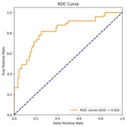 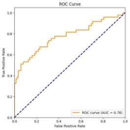

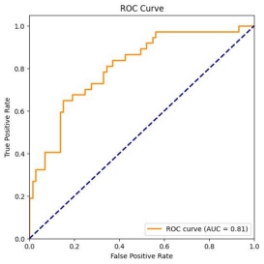

*Figure 1.3 ROC curves (1) SVM (2) Decision Jungle (3) ANN*

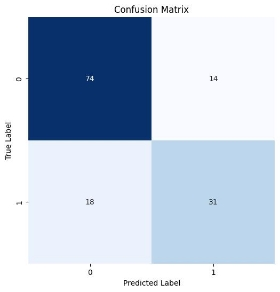 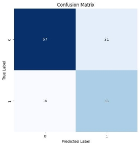

*Figure 1.4 Confusion Matrices (1) SVM (2) Decision Jungle (3) ANN*

5. **Framework 2**
1. **Methodology**

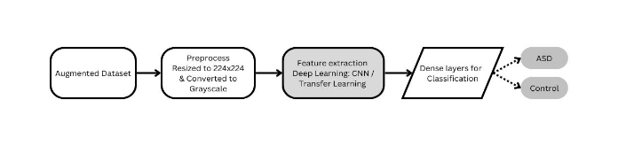

*Figure 1.5 Methodology for Framework 2*

Framework 2 is slower than Framework 1, but it produces more consistent results. The process for implementing Framework 2 can be seen in Figure 5.

First, the augmented dataset was resized to 224x224 and converted to grayscale using the formula:

New grayscale image = (0.3 \* R) + (0.59 \* G) + (0.11 \* B).

*Equation 1.1 Grayscale* formula

This step was performed to speed up the model training time, as working with grayscale images require fewer computational resources compared to colored images.

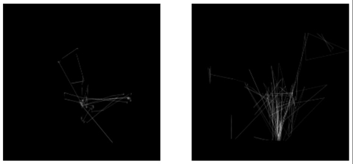

*Figure 1.6 Preprocessed Grayscale Images*

After preprocessing, the images were fed into deep-learning models for feature extraction. The first model tested was a custom Convolutional Neural Network (CNN) architecture.

2. **Convolutional Neural Networks (CNN)**

Convolutional Neural Networks (CNNs), (Oliveira et al., 2021) automatically learn and extract relevant features from input data, such as images. These extractors consist of multiple

convolutional layers, which apply filters (also known as kernels) to the input data to produce

feature maps. These feature maps represent the spatial arrangement of learned features at different levels of abstraction. As the data moves through the layers of a CNN, the feature extractors become capable of detecting increasingly complex and high-level patterns.

In the initial layers of a CNN, the feature extractors usually identify simple patterns, such as edges and textures. As the data moves deeper into the network, the feature extractors learn to recognize more complex structures, like object parts or even entire objects. The learned features are then combined and used by subsequent layers in the network, such as fully connected layers, to make predictions or perform other tasks like object detection and segmentation. The ability of CNN feature extractors to learn hierarchical representations of input data enables them to be effective for various computer vision tasks, including image classification, object detection, and semantic segmentation.

3. **CNN Architecture**

The custom CNN architecture, shown in Figure 1.7, consists of four groups of Conv2D, MaxPooling, and BatchNormalization layers. After passing through the four groups, the output was flattened and then passed through two dense layers with dropouts to prevent overfitting. Finally, a sigmoid function was used to obtain probabilities.

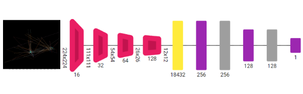

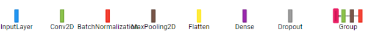

*Figure 1.7 Architecture of CNN*

4. **Transfer Learning**

In addition to the custom CNN, the preprocessed dataset was tested on some transfer learning models. Transfer learning (Arai, 2021) is a technique where a pre-trained model, usually on a large-scale dataset, is fine-tuned to perform a new task. This approach leverages the knowledge acquired by the model during its initial training and can lead to faster convergence and improved performance on the new task.

Three popular transfer learning models were tested: VGG16, ResNet50(苏, 2022), and MobileNetV3(Zhang et al., 2023). VGG16 is a deep CNN architecture known for its simplicity and strong performance on image classification tasks. It consists of 16 layers, including 13 convolutional layers and three fully connected layers. ResNet50 is another deep CNN architecture that introduced the concept of residual learning, which allows for training very deep networks without suffering from vanishing or exploding gradients. MobileNetV3 is a more lightweight CNN architecture that focuses on efficiency, making it suitable for mobile and embedded applications. It employs depthwise separable convolutions and other optimizations to reduce computational complexity while maintaining good performance. The top layers were not included and the pre-trained layers were frozen during model training followed by a 1024 nodes dense layer and finally sigmoid to get predictions.

5. **Experimentation and Results**

The results for Framework 2, which focused on using CNN and transfer learning models, showed a higher performance compared to Framework 1. First, the custom CNN model was trained for 15 epochs using the Adam optimizer and binary cross-entropy as the loss function. This model achieved an impressive accuracy of 92% and an AUC of 96 (as seen in Figure 6). Additionally, it had a precision of 0.91, a recall of 0.90, an F1 score of 0.89, and a sensitivity of 0.81. The ROC curve and confusion matrix for this model can be viewed in Figure 8.

Next, the MobileNetV3 model, which is known for its lightweight architecture and efficiency, was trained for 20 epochs. It obtained an accuracy of 86% and a ROC of 94. Furthermore, it had a precision of 0.86, recall of 0.81, F1 score of 0.77, and sensitivity of 0.68. The confusion matrix and ROC curve for this model can be viewed in Figure 9

The ResNet50 model, which utilizes residual connections to address the vanishing gradient problem, was trained for 10 epochs due to its computational demands. It achieved an accuracy of 87% and a ROC of 93. Moreover, it demonstrated a precision of 0.86, a recall of 0.85, an F1 score of 0.82, and a sensitivity of 0.79. The confusion matrix and ROC curve for this model can be viewed in Figure 10.

Lastly, the VGG16 model, known for its deeper architecture, was trained for only 5 epochs because of its high computational requirements. It managed to achieve an accuracy of 81% and a ROC of 0.88. The model also had a precision of 0.91, recall of 0.79, F1 score of 0.74, and sensitivity of 0.66. The confusion matrix and ROC curve for this model can be viewed in Figure 11

In summary, the custom CNN model outperformed the transfer learning models in terms of accuracy, AUC, precision, recall, F1 score, and sensitivity. This highlights the potential benefits of developing tailored CNN architectures for specific tasks. However, it is important to consider the trade-offs in computational expense and training time, particularly for deeper models like ResNet50 and VGG16, whose results could definitely be improved by training for more epochs. While the custom CNN model achieved the best overall results, transfer learning models such as MobileNetV3 and ResNet50 still provided competitive performance with potentially faster training times and reduced computational resources.

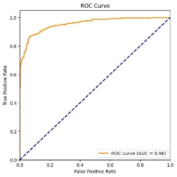 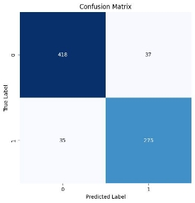

*Figure 1.8 ROC curve and Confusion matrix custom CNN*

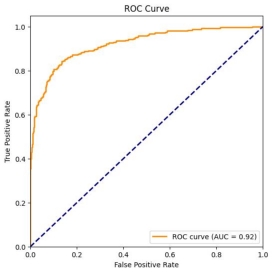 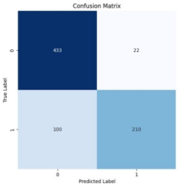

*Figure 1.9 ROC and Confusion Matrix MobileNetV3*

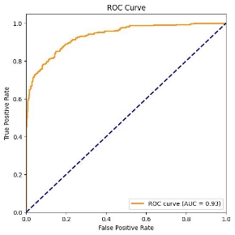 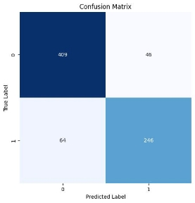

*Figure 1.10 ROC and Confusion Matrix ResNet50*

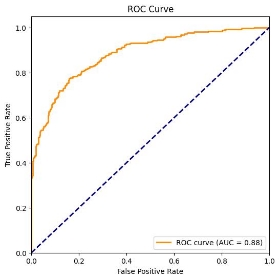 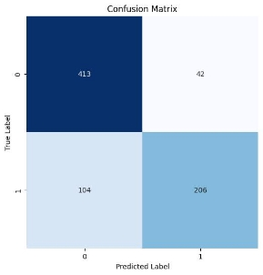

Figure 1.11 ROC and Confusion Matrix VVG16

|**Model**|**Accuracy**|**AUC**|**Precision**|**Recall**|**F1 Score**|
| - | - | - | - | - | - |
|*SVM ( F1)*|77%|0\.82|0\.75|0\.77|0\.76|
|*Decision Jungle (F1)*|73%|0\.78|0\.71|0\.72|0\.73|
|*ANN (F1)*|71%|0\.81|0\.67|0\.54|0\.67|
|*CNN(F2)*|92%|0\.96|0\.91|0\.89|0\.83|
|*MobileNetv3 (F2)*|86%|0\.92|0\.86|0\.81|0\.77|
|*ResNet(F2)*|87%|0\.93|0\.86|0\.85|0\.82|
|*VVG16(F2)*|81%|0\.88|0\.91|0\.79|0\.74|

*Table 1. 2 : Comparing evaluation metrics for Framework 1 and 2*

6. **Analytical Comparison Framework 1 and 2**

When comparing the performance of Framework 1 and Framework 2 (check Table 2), it is evident that Framework 2 outperformed Framework 1 in terms of the obtained evaluation metrics. Framework 1, which focused on using PCA for feature extraction and traditional machine learning classifiers, achieved an accuracy of up to 77% (using SVM), while Framework 2, which utilized CNN and transfer learning models, reached a maximum accuracy of 92% (with the custom CNN model). The superior performance of Framework 2 can be attributed to the ability of deep learning models to capture more complex and abstract features in the input data, which in turn allows for better discrimination between the classes.

In the case of Framework 1, PCA was used to reduce the dimensionality of the data and extract important features. However, this approach might not capture all the relevant information present in the eye-tracking scanpath images. On the other hand, Framework 2 leverages the power of deep learning models, which can automatically learn hierarchical feature representations from the data. This allows the models to capture more intricate patterns in the images, leading to improved classification performance.

7. **Conclusion to Part 1**

Using eye-tracking to detect autism was the main concept of this project. Successful experimentation revealed that converting eye-tracking data into pictures that determine if a child has autism proves to be fruitful. This unique approach to diagnosis is a cost-effective solution that is easier than traditional methods, allowing healthcare professionals and parents to detect early on if a child has autism.

Experiments showed that the performance of traditional machine learning methods was inferior to that of custom CNNs and transfer learning models based on deep learning. However, in order to improve the accuracy of these models for detecting autism in individuals, further investigation is necessary.By identifying individuals with autism early and offering the appropriate support, eye-tracking, and machine learning can assist those individuals and their families.

This eye-tracking technique may be helpful not only for autism but also for other mental illnesses like ADHD. Further study may reveal how eye-tracking can be used to diagnose various ailments and facilitate patient access to necessary care.

Overall, this research demonstrated that eye-tracking may be an excellent method for making an early diagnosis of autism. This approach might become more accurate and effective with additional studies. It should pave the way for more accurate methods of diagnosing conditions like autism.

2. **Part 2 - Automatic Autism Diagnosis Web Application**
1. **Overview and Problem Description**

Specialized equipment is necessary for obtaining eye-tracking data, which has become a valuable diagnostic and research tool for various neurological and mental conditions like Autism Spectrum Disorder (ASD) and Attention Deficit Hyperactivity Disorder (ADHD). Collecting data can be time-consuming and costly, presenting a challenge for healthcare professionals and researchers seeking to gather enough data for their studies. Part 2 of the project will produce a webapp that simplifies access to diagnostic tools, which can be difficult in areas with limited healthcare resources. The webapp uses webcams to gather and evaluate eye-tracking information that is useful in identifying many mental and neurological disorders.

The primary target users of the web app are researchers who wish to collect eye-tracking data more efficiently, healthcare professionals seeking to expedite the diagnostic process, and individuals from the general public who desire early screening options in areas where access to healthcare is limited. The web app offers several customizable pages, including a page for collecting eye-tracking data in CSV format, a page for converting CSV data into eye-tracking scan paths, a page for running predictions on scan path images using models trained in Part 1 or user-uploaded models, and a page for retraining models with newly collected datasets to improve accuracy and performance.

To develop this web app, the project utilizes WebGazer, an open-source library for eye-tracking created by Brown University, as well as other technologies such as JavaScript, Python flask, and CSS for formatting. Each page within the web app can function as a standalone tool, offering flexibility to users who may have already collected eye-tracking data using alternative methods or equipment. For example, a researcher with their own eye-tracking data can still use the web app to convert CSV data into scan path images and leverage the other pages for prediction and model training.

The web app's potential extends beyond ASD diagnosis, as it can also be adapted to study and diagnose other mental and neurological conditions, such as ADHD. By offering an accessible, cost-effective solution for eye-tracking data collection and analysis, the web app

aims to advance research in these fields and enable early detection and intervention for those in need. The integration of webcam technology allows for more widespread and convenient use of eye-tracking tools, providing valuable resources for researchers, healthcare professionals, and the public alike. As this project progresses, further enhancements and refinements to the web app can be made based on user feedback and evolving technological advancements, ultimately driving innovation in the field of eye-tracking research and its applications in various mental and neurological conditions.

2. **High-Level Structure of the Web Application**

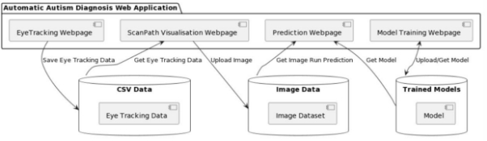

*Figure 2.0- High-Level architecture diagram- Automatic Autism Diagnosis Web Application*

A total of four web pages make up the web application: Webpage One, the Eye Tracking webpage, utilizes a webcam to track the user's gaze. It saves the gaze-tracking coordinates into a CSV file, allows users to set the sampling rate delay, and allows them to calibrate eye-tracking. Webpage Two, Eye Tracking Image Visualization, enables users to upload the CSV file of eye tracking data and visualize it on images as scan paths, with the option to apply data smoothing. Webpage Three, the Prediction webpage, offers pre-trained deep learning models for binary image classification tasks for Autism detection and supports custom class labels and user-uploaded models. Webpage Four, Retraining Model, allows users to upload image datasets, select or upload models for retraining, set the number of training epochs, and download the retrained model. A detailed description of each webpage is given in the subsequent sections.

3. **Eye Tracking Webpage**

The webpage is designed for eye tracking and gaze tracking, using a webcam to detect where a person is looking on the screen and then save that information into a CSV file. Researchers can collect eye-tracking data inexpensively by simply using a normal webcam. Customizable features include controlling the sampling rate, pausing, and resuming tracking. The website can be run in the background while the person is tasked to perform a task or view a visual stimulus. Performance and tracking accuracy improve with better lighting and higher-quality webcams.

1. **Layout and User Interactions**

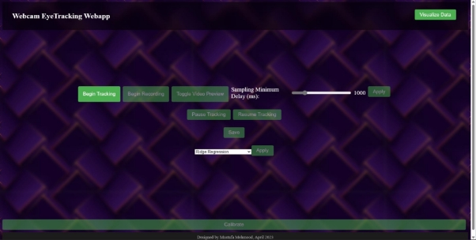

*Figure 2.1: Eye Tracking Webpage Initial load page*

Initially, only the "Begin Tracking" button is clickable( Figure 2.1 ). Upon clicking, the website requests camera permissions, and all other buttons become active. The tracking process starts, although data recording does not begin until the "Begin Recording" button is clicked. A video preview appears on the top left side of the screen, allowing the user to adjust their head position until the frame turns green, indicating proper alignment. A moving red dot appears on the screen, approximately indicating where the user is looking.( Figure 2.2)

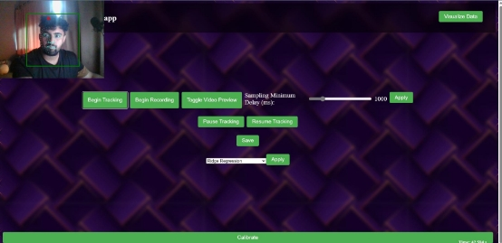

*Figure 2.2 Eye tracking webpage with video preview*

Once the tracking process has started, the user is advised to click the "Calibrate" button at the bottom of the webpage. This opens an overlay with red dots spread across the screen. Clicking a dot turns it from red to green, indicating calibration at that point. The complete calibration system will be explained in a later section detailing the WebGazer.js library used on the website. The calibration overlay can be closed by clicking the cross button in the top right corner. (Figure 2.3)

The bottom right of the screen shows the X and Y coordinates and time stamps in real-time.

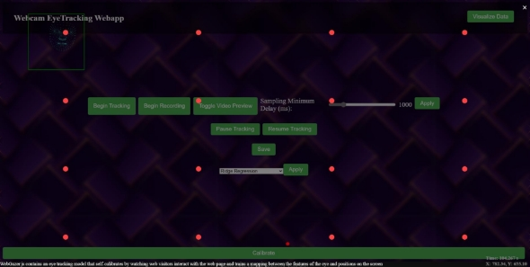

*Figure 2.3 Calibration overlay with dots*

Next to the "Begin Tracking" button is the "Begin Recording" button, which allows the user

to start saving the x, y coordinates, and time stamps into a CSV file. The "Save" button enables the user to download the CSV file. Additional features include "pause" and "resume" tracking buttons, a "Toggle Video Preview" button to enable or disable the video preview, and a sampling rate slider for introducing a delay rate between 0 ms and 5 seconds in 50 ms increments.

The webpage also offers a dropdown list for selecting a regression model from a list of eye-tracking ML models. In the header's top right, there is a button to navigate to the next page for "Visualizing CSV eye tracking data to Image."

2. **Webgazer Open-Source Library**

By the ingenious minds at Brown University, WebGazer.js has been developed as an eye-tracking software.(*WebGazer.Js: Democratizing Webcam Eye Tracking on the Browser*, n.d.) It's a cheaper alternative as it allows regular webcams. Completely suitable for web applications and flexible enough for easy integration into projects, the software is perfect for researchers and developers in need of eye-tracking features.

Based on user interactions and clicks, an automatic calibration process is implemented in WebGazer.js. By clicking on various parts of the screen, the library adapts its internal model and accurately predicts the user's gaze location. This approach ensures the system adjusts to each user's unique behavior, maintaining accuracy throughout the tracking process. Choosing from various ML models, WebGazer.js grants the flexibility to suit individualized needs or experiment to optimize application performance. This allows users the freedom to select the best model for their personal preference.

3. **Functional Requirements**
1. The application must allow the user to initiate the eye-tracking process, request camera permissions, and activate other buttons by clicking the "Begin Tracking" button.
1. The application must display a video preview for proper head alignment, providing visual feedback with a green frame and a moving red dot indicating the user's gaze

   position.

3. The user must be able to calibrate the eye-tracking process by clicking the "Calibrate" button and interacting with red dots in the overlay.
3. The application must display real-time X and Y coordinates and time stamps on the screen.
3. The user must be able to start, stop, and download data recording as a CSV file using the "Begin Recording" and "Save" buttons.
3. The application must provide pause and resume functionality for eye-tracking.
3. The user must be able to toggle the video preview on or off using the "Toggle Video Preview" button.
3. The application must provide a sampling rate slider for adjusting the delay rate between 0 ms and 5 seconds in 50 ms increments.
3. The user must be able to select a regression model from a dropdown list for eye-tracking ML models.
3. The application must include a button for navigating to the next page for "Visualising CSV eye tracking data to Image."
4. **UML- Diagrams**

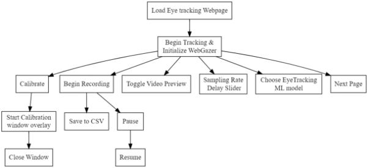

*Figure 2.4 Flow Chart Diagram*

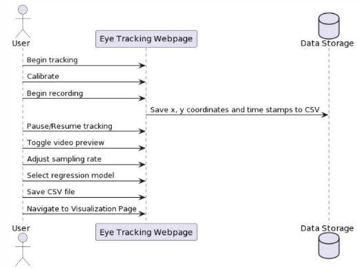

*Figure 2.5 Sequence Diagram*

5. **WebPage Components**

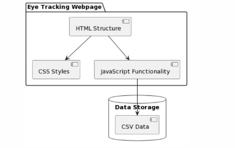

*Figure 2.6 Component Diagram*

The primary components are HTML, CSS, and JavaScript. The application leverages the Webgazer.js library for its eye-tracking functionality, enabling users to interact with the

interface and control the tracking process.

The HTML structure provides the foundation for the application, containing the main elements such as buttons, sliders, and calibration points. In tandem with HTML, the CSS file dictates the visual appearance, defining the layout, colors, and styles for various elements. The CSS also incorporates styles for calibration points and popup windows, ensuring a consistent and appealing design. Meanwhile, the JavaScript file is responsible for the core functionality of the application, handling tasks like initializing Webgazer, converting eye-tracking data to CSV, and managing button interactions. The code also includes event listeners for user interactions, such as clicking buttons, adjusting sliders, selecting ML models for tracking, and updating real-time X and Y positions with time stamp trackers. Together, these components create an interactive and user-friendly eye-tracking web application.

4. **EyeTracking Image Visualisation Webpage**

This page enables users to upload gaze-tracking data and visualize it on images. It is designed to accept CSV files containing x and y coordinates along with timestamps, which are then mapped onto two images – the original and the smoothed version.

1. **Page Layout and User Interactions**

The header features a title, "Webcam EyeTracking Webapp," and a button labeled "Record Eye Tracking '' for navigating to the EyeTracking webpage.

Users are prompted to upload a CSV file containing the gaze tracking data. A smoothing level drop-down list allows users to select the desired degree of smoothing applied to the data, and an "Apply" button confirms the selection. ( Figure 2.7)

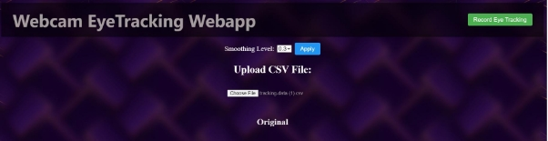

*Figure 2.7 Section 1 of EyeTracking Scan-path Visualisation Webpage*

The second and third sections contain the canvas elements where the original and smoothed images are displayed. Each canvas is accompanied by a descriptive title – "Original" and "Smoothed," respectively.

Upon uploading a CSV file, the gaze tracking data is parsed, and the original image is rendered on the canvas. Users can then apply a smoothing filter, selecting from a range of values between 0.1 and 0.9. This customizability allows users to achieve the desired level of smoothness in their visualizations. The smoothed image is displayed on the second canvas, providing a clear comparison between the original and smoothed gaze tracking data.

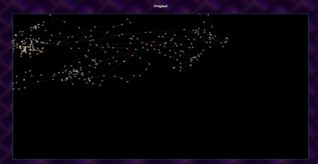

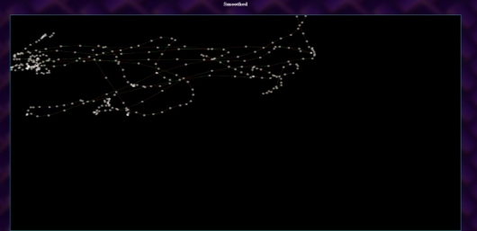

*Figure 2.8 Sections 2 and 3 Showing Orignal and Smoothed versions of Mapped Images*

2. **Visualisation Smoothening**

The webpage applies exponential moving average smoothing to the gaze tracking data, enhancing the visual representation of the user's gaze patterns. This smoothing process considers the user-selected level of smoothness and applies a weighted average to the data points. As a result, the smoothed image provides a clearer and more coherent visualization of the user's gaze movements.

3. **Functional Requirements**
1. The webpage must provide the ability to upload gaze tracking data in the form of CSV files containing x and y coordinates, and timestamps.
1. Upon uploading a CSV file, the web app must parse the gaze tracking data and convert it into a usable format for further processing and visualization.
1. The webpage must render the original gaze tracking data on a canvas, providing a visual representation of the user's gaze patterns without any modifications.
1. The webpage must allow users to select a smoothing level from a drop-down list with customizable values ranging from 0.1 to 0.9. The selected value will be used to apply exponential moving average smoothing to the gaze tracking data
1. The webpage must apply exponential moving average smoothing to the gaze tracking data based on the user-selected smoothing level. The web app must render the smoothed gaze tracking data on a separate canvas, allowing users to visually compare the original and smoothed gaze patterns.
1. The webpage must provide a button to navigate to the Eye-tracking webpage.
4. **UML-Diagrams**

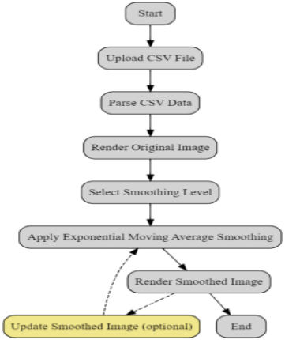

*Figure 2.9 Flow Chart EyeTracking Visualizer Web page*

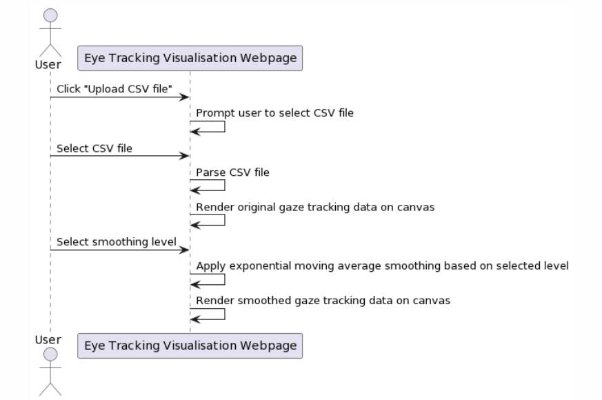

*Figure 2.10 Sequence Diagram*

5. **Webpage Components**

This webpage is built using HTML, CSS, and JavaScript. The HTML code structures the webpage, defining the layout and various elements, such as the file input, drop-down list for smoothing level selection, and canvas elements for displaying the original and smoothed gaze tracking data. CSS is employed to style the webpage, ensuring a consistent visual presentation across different screen sizes and devices.

The JavaScript code is responsible for handling file uploads, parsing the CSV data, and converting it into a usable format for further processing. It also implements the exponential moving average smoothing algorithm, which is applied to the gaze tracking data based on the user-selected smoothing level. Additionally, JavaScript is responsible for rendering both the original and smoothed gaze-tracking data onto the respective canvas elements, allowing users to visually compare the two sets of data. Event listeners are employed to handle user interactions, such as changing the smoothing level or updating the smoothed image without having to re-upload the CSV file

5. **Prediction Webpage**

This page is designed for users to leverage pre-trained deep-learning models for binary image classification tasks. In the context of the project, the webpage is specifically used to predict whether a person has Autism or not based on Eye Tracking Scan Path images uploaded by users. The webpage features a selection of pre-trained deep learning models, including CNN, MobileNetV3, VGG16, and ResNet50. Users can also upload their own deep learning models, provided they meet the specified requirements: the model should be in Hierarchical Data Format (HDF) and compatible with the Keras deep learning library, and it should accept image sizes of 224x224x3, as the backend code preprocesses images into this size before passing them to the model. Additionally, the webpage allows users to set custom class labels for binary classification.

1. **Launching the Webpage Locally**

To launch the web application, first, run the app.py file located in the "PredictionWebsite"

folder. This file uses the Flask framework, which creates a web server to host the web application. After running app.py, the user should go to the URL displayed in the Python terminal, which is usually http://127.0.0.1:5000/. Accessing this URL opens the web application in the user's web browser, allowing them to interact with the webpage's features and perform binary image classification tasks.

2. **Page Layout and User Interactions**

The webpage layout is designed to facilitate a seamless and intuitive user experience. Upon opening the webpage, users are prompted to select a deep learning model from a list of pre-trained models, including CNN, MobileNetV3, VGG16, and ResNet50. Alternatively, users can upload their own custom model by clicking the "Upload Model" button. Custom models should be in Hierarchical Data Format (HDF) and compatible with the Keras deep learning library. Once a custom model is uploaded, the list of available models is updated to include the user's model. ( Figure 2.11 )

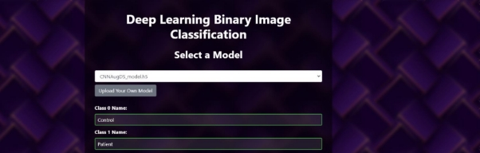

*Figure 2.11 Prediction Website - Section 1 - Model Selection, Model Upload, Class Labels*

Below the model selection section, users can set custom class labels using two text fields. These labels will be displayed as prediction names when the classification is performed. Following this, the user can upload an image by clicking the "Upload Image" button. The webpage accepts jpg and png image formats and displays the uploaded image in a preview window.

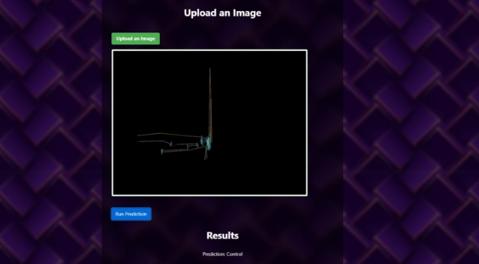

*Figure 2.12 Prediction Website - Section 2: Upload Image, Preview and Results*

Finally, the "Run Prediction" button initiates the classification process. When clicked, the image is fitted to the selected model in the backend, and the prediction is made. The result is then displayed as text on the webpage, informing the user of the predicted class label. The webpage's layout and design ensure that users can easily navigate and interact with its various features to perform binary image classification tasks.

3. **Functional Requirements**
1. Model Selection:
   1. Provide a dropdown menu containing a list of pre-trained models available for use.
   1. Allow users to upload their custom deep learning models in a compatible format (e.g., HDF).
1. Image Upload:
   1. Enable users to upload an image file in common formats (e.g., JPEG, PNG, GIF) for classification.
   1. Display a preview of the uploaded image on the webpage for user confirmation.
1. Image Preprocessing:
1. Automatically resize the uploaded image to the required dimensions (e.g., 224x224 pixels) for the selected model.
2. Convert the image to grayscale and merge it into an RGB image to ensure compatibility with the deep learning models.
2. Transform the processed image into a format suitable for input into the deep learning model .
4. Prediction:
   1. Initiate the prediction process upon user request (e.g., "Run Prediction" button click).
   1. Pass the preprocessed image and selected model to the Python Flask server for prediction.
   1. Display the prediction results on the webpage, including class labels and confidence score.
4. Backend Processing:
1. Load pre-trained deep learning models using the Keras library on the Python Flask server.
1. Handle incoming requests from the JavaScript front, such as fetching model data or sending prediction data.
1. Return the prediction results to the front end for display.
4. **UML Diagrams**

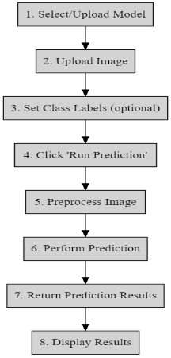

*Figure 2.13 Flowchart Prediction Website*

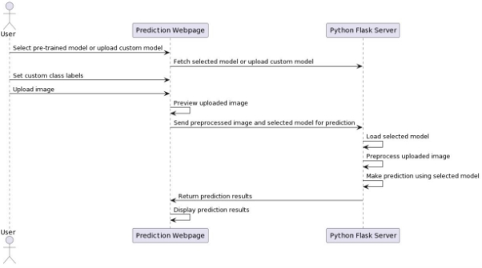

*Figure 2.14 Sequence Model*

5. **Webpage Components**

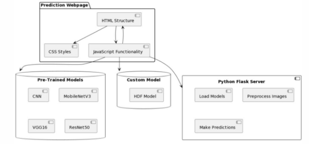

*Figure 2.15 Component Diagram*

The webpage is composed of several components that work together to provide a seamless user experience. These components are HTML, JavaScript, and a Python Flask file, which are each responsible for different aspects of the webpage's functionality.

The HTML file serves as the foundation of the webpage and is responsible for defining the structure and layout of the user interface. This includes elements such as the model selection dropdown, image upload section, class label text fields, and the prediction results display. The HTML file also includes links to external resources, such as the Bootstrap CSS library for styling and jQuery for JavaScript simplification.

JavaScript plays a crucial role in enabling interactivity and handling user input on the webpage. It is responsible for fetching and displaying the pre-trained models, handling custom model uploads, previewing uploaded images, and running the prediction when the user clicks the "Run Prediction" button. Additionally, JavaScript is used to communicate with the Python Flask server by sending requests to fetch model data or send prediction data.

As the website's backend, the Python Flask file controls server-side operations and responds to incoming JavaScript requests. By offering a limited set of functions to handle requests and responses, the lightweight web framework Flask makes it easier to develop the server. The

Keras library-loaded pre-trained models must be loaded, the uploaded images must be processed, and the prediction results must be returned by the Flask server. The Hierarchical Data Format (HDF) models are loaded, the images are processed, and predictions are made using the Keras library, a high-level deep learning library.

Before passing the image to the model, image preprocessing is required. The uploaded image is first opened with the Python Imaging Library (PIL) and resized to a standard size of 224x224 pixels in this project. The image is then converted to grayscale and merged into an RGB image to ensure compatibility with deep-learning models. The image is then expanded to an additional dimension and transformed into a NumPy array to meet the input specifications of the Keras models.

6. **Model Retraining Webpage**

The Model Retraining Webpage is a crucial component of your web application, designed to empower researchers to enhance the performance of binary deep learning models that were initially trained in Part 1 of your project. These models are specifically tailored for the binary classification of eye-tracking scan path images of autistic and control subjects. By allowing researchers to upload a new binary dataset of images, the webpage enables them to retrain the models and customize them according to their specific needs. Retraining models with new datasets can lead to improved performance and adaptability, ensuring that the models remain relevant and effective in addressing the unique requirements of each research project.

The webpage offers a variety of features to facilitate this process, including the ability to choose from a list of pre-existing models such as CNN, ResNet50, VGG16, and MobileNetV3. Additionally, users can upload their own models in .h5 format, provided that they accept 224x224x3 dimension images. The webpage also allows users to set the number of epochs for training and upload a dataset of images in zip format, with two folders containing images for each class. Once the training is complete, users can download the retrained model for further use.

1. **Launching the Webpage**

To launch the Model Retraining Webpage, you must first run the app.py file located in the "RetrainingWebsite" folder. This is necessary because the webpage relies on Python Flask for most of its backend functionality. After running app.py, navigate to the URL displayed in the Python terminal, which is typically http://127.0.0.1:5000/. This step ensures that the web application is properly initialized and ready for use.

2. **Webpage Layout and User Interactions**

The layout of the Model Retraining Webpage is designed to facilitate seamless user interaction. The first section,( Figure 2.16) "Select Dataset," allows users to upload a zip file containing their dataset of images by clicking "Choose File." The dataset should consist of two folders, each containing images for one of the two classes. Once the dataset is selected, users can upload it using the "Upload Dataset" button. A message appears on the screen once zip file has been successfully uploaded.

*Figure 2.16 Section 1 Retrain Model Website*

For those who wish to use their own models, the "Upload your own Model" section provides the option to select a model from their local file directory by clicking "Choose File" and then uploading it using the "Upload Model" button. The webpage accepts .h5 models designed for Keras, with the requirement that they accept 224x224x3 input images, as the backend image processing of the application processes images to this size. After uploading a model, the list of models in the "Select Model" section is updated to reflect the new addition. A message appears on the screen once .h5 file has been successfully uploaded.

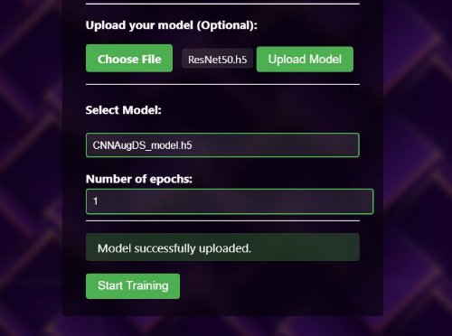

*Figure 2.17 Section 2 and 3 Model Upload and Selection*

In the "Select Model" section, (Figure 2.17) users can choose a model from the dropdown list and specify the number of epochs for training using the provided number fields. By clicking the "Start Training" button, the retraining process begins. Users can monitor the training progress and metrics from the terminal window used to launch the Flask application (app.py).(Figure 2.18)

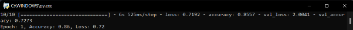

*Figure 2.18 Monitoring Training progress and metrics*

Upon completion of the training, users can download the retrained model by clicking the "Download Model" button. (Figure 2.19) This feature allows researchers to easily access and utilize the enhanced model for their specific needs, further demonstrating the versatility and adaptability of the Model Retraining Webpage.

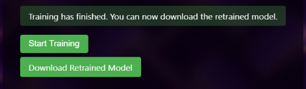

*Figure 2.19 Retrain Model Download*

3. **Functional Requirements**
1. Dataset Upload:
   1. The webpage must allow users to upload a zip file containing a dataset of images.
   1. The dataset should consist of two folders, each containing images for one of the two classes (autistic and control subjects).
   1. The webpage should provide a clear and user-friendly interface for selecting and uploading the dataset.
1. Model Selection and Upload:
   1. The webpage must offer a list of pre-existing models for users to choose from, including CNN, ResNet50, VGG16, and MobileNetV3.
   1. The webpage must allow users to upload their own models in .h5 format, with the requirement that they accept 224x224x3 input images.
   1. The uploaded models should be added to the list of available models in the "Select Model" section.
1. Training Configuration:
   1. The webpage must provide an interface for users to select a model from the list of available models.
   1. The webpage must allow users to specify the number of epochs for training using a number field.
1. Model Retraining:
1. The webpage must initiate the retraining process upon clicking the "Start Training" button.
1. The retraining process should utilize the selected model, dataset, and specified number of epochs.
3. The webpage should display the training progress and metrics in the terminal

   window used to launch the Flask application (app.py).

5. Model Download:
1. Upon completion of the training, the webpage must enable users to download the retrained model.
1. The download process should be initiated by clicking the "Download Model" button.
1. The retrained model should be easily accessible and usable by researchers for their specific needs.
4. **UML Diagrams**

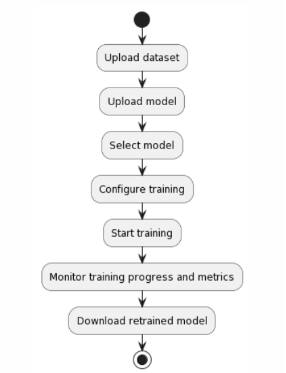

*Figure 2.20 FlowChart Model Retraining Webpage*

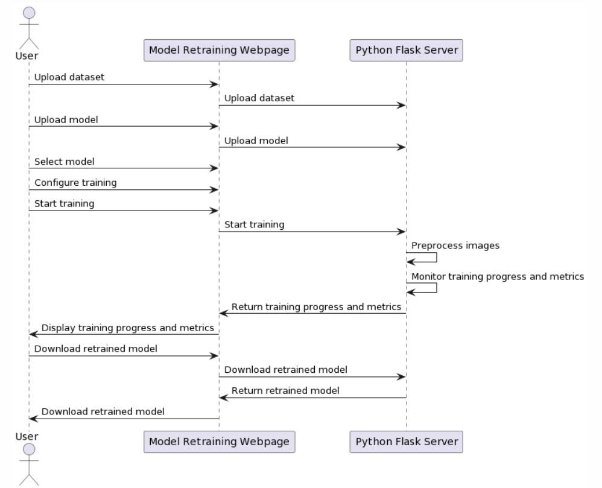

*Figure 2.21 Sequence Diagram*

5. **Webpage Components**

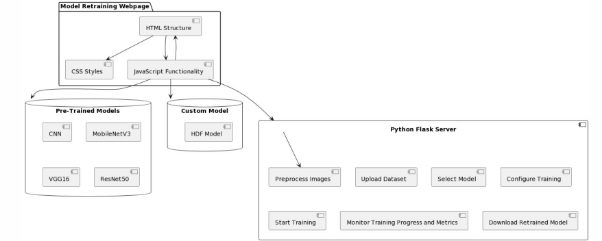

*Figure 2.22 Component Diagram*

The website's components consist of HTML, CSS, JavaScript, and a Flask application (app.py).

These components work together to create a seamless user experience for uploading datasets, selecting and uploading models, configuring training parameters, and downloading the retrained model.

HTML and CSS are responsible for the structure and styling of the webpage, respectively. They define the layout, appearance, and user interface elements such as buttons, input fields, and file upload components. The HTML structure includes sections for dataset and model uploads, model selection, training configuration, and model download. CSS ensures that the webpage is visually appealing and responsive across various devices and screen sizes.

JavaScript is responsible for handling user interactions and providing dynamic functionality. For example, it updates the displayed file names when users select a dataset or model for upload. Additionally, JavaScript listens for click events on download links and sets a delay to allow the download and file deletion processes to complete before reloading the page.

The Flask application (app.py) serves as the backend for the website, handling dataset and model uploads, model retraining, and model downloads. It defines routes for handling HTTP requests, such as uploading datasets and models, initiating the retraining process, and downloading the retrained model. The app.py file also contains functions for preprocessing images, retraining the model, and cleaning up the upload folder after the training process is complete.

These components interact with each other to create a cohesive user experience. When users interact with the webpage, JavaScript captures their actions and communicates with the Flask application via HTTP requests. The Flask application processes these requests, performs the necessary actions (e.g., model retraining), and returns the appropriate response. The webpage then updates its content and appearance based on the response, providing users with real-time feedback on their actions.

3. **Conclusion**

In conclusion, this project successfully combined research and application development to improve the diagnosis of autism using eye tracking data and machine learning models. In part one of the project, two different frameworks were tested for diagnosing autism: one was using PCA and the other was using deep learning models. Although the PCA-based approach was faster, the deep learning approach proved to be more accurate, achieving an impressive AUC of 0.96. However, challenges such as data scarcity and the need for expensive eye-tracking equipment were identified.

For addressing these issues, the focus of part two of the project was developing a web application that simplifies the process of collecting eye tracking data using just a webcam. This application not only visualises the eye tracking data but also allows users to easily run predictions using the models trained in the first part of the project. Furthermore, the app empowers researchers with less technical expertise in machine learning to retrain existing models or train new ones tailored to their specific needs.

The promise of this undertaking rests in its ability to render autism diagnosis affordable, precise and accessible. With its simplified data gathering methods and its straightforward devices for pattern prediction and training, the application can facilitate a more thorough comprehension and identification of autism for both analysts and practitioners.

For the betterment of society, I truly see this project's potential to be immense. Individuals with autism can greatly benefit from the bettered early detection and intervention that this project can bring, leading to improved quality of life and outcomes, which also extends to their family.

4. **Reflection**

Reflecting on my work for my undergraduate dissertation full year project , I must say it was a thrilling ride. Diving into the depths of machine learning, computer vision, data science, and web development, I marvelled at how these distinct fields intertwined to tackle real-world conundrums.

A highlight of this journey was employing machine learning and computer vision techniques to address a pressing issue: autism diagnosis. This endeavour not only enriched my understanding of these technologies but also unveiled their potential to create a societal ripple effect. I grasped the importance of selecting apt models and frameworks while navigating the challenges of data paucity and specialized equipment demands.

During my research, I honed my critical thinking and problem-solving prowess by juxtaposing various strategies and evaluating their effectiveness. Simultaneously, I refined my ability to articulate intricate concepts and findings with clarity and brevity, a skill indispensable when presenting to diverse audiences.

The web development segment of my project offered hands-on experience in crafting and executing user-centric interfaces, a task both challenging and rewarding. I recognized the necessity of considering end-users' needs and preferences while developing applications and the merits of iterative design and testing to ensure seamless user experiences.

Collaborating closely with my project supervisor, I discovered the essence of efficient communication and teamwork. I learned to actively listen, solicit feedback, and adapt my methodology based on others' insights. This collaborative approach not only elevated my work's quality but also fostered robust interpersonal skills that will serve me well in my future endeavors.

My knowledge, abilities, and confidence in computer science all underwent significant expansion thanks to this project, which I found to be an incredibly gratifying experience. I also appreciated having the opportunity to lend a hand in a meaningful project that has the potential to make a positive impact on individuals and families influenced by autism. Going forward in my career, I intend to carry forward the knowledge that I gleaned from this endeavor and to carry on exploring the tantalizing prospects that computer science has in store.

5. **Future Work**

Exploring new frameworks, improving prediction performance of models, and enhancing efficiency and accuracy are among the multiple areas I aim to improve when looking towards the future of my project. While the models already achieved impressive results, there's always room for more. As such, I plan to try better preprocessing techniques and other methods. Training and testing methods will be a focal point in my research moving forward. Robustness of the models will be improved through increased data collection. Exploratory research will look at numerous models to achieve the desired results.

Using eye tracking and machine learning, I intend to broaden my research to encompass

various mental disabilities beyond autism. Though the project has focused on autism, other ailments also stand to profit from these approaches. I intend to delve into how these techniques can be implemented with different ailments and invent models that can predict and diagnose results for various mental disabilities.

In addition to improving the models themselves, I also plan to improve the reliability of eye tracking with a webcam. While the webcam-based approach I developed in this project was effective, there is always room for improvement.

To boost my data's consistency and precision, I'll construct a personal eye tracking system. This advancement will subsequently bolster my models' accuracy.

My long-term goal involves the worldwide expansion of this project through a website launch, facilitating accessibility for researchers and clinicians around the globe to utilize its models for diagnosing and predicting outcomes, particularly for those living with mental disabilities including autism. I anticipate that this can be achieved by enhancing the user interface with greater intuitiveness and improved user experience.

To expand on my research, I am interested in delving into alternative data sources besides eye tracking. My goal is to analyze speech patterns and facial expressions in order to bolster the precision of my models. Integrating varied forms of data holds promise for constructing more trustworthy models that will aid in prognosis and diagnosis for those living with cognitive disabilities.

To improve the quality of life for those affected by mental disabilities, I have devised a plan to work closely with other researchers and clinicians in the field. Sharing knowledge and expertise will allow us to develop and refine our models more effectively. Ultimately, collaboration is key to our success in this field.

**5. Appendix**

1. **Acknowledgement**

I want to express my appreciation to Mr. Hafeez Ullah Amin, my project supervisor, for leading me and giving me guidance throughout the project. Furthermore, I also want to thank my family members and friends for supporting me in doing this project.

2. **Download Requirements**

The Following packages and applications need to be installed:

- Jupyter Notebook
- Python > 3.10 and the following packages:

Open CV (cv2), numpy, sklearn, tensorflow, matplotlib, seaborn, MobileNetV3, ResNet50, VVG16

- JAVA Script
- PYTHON FLASK
3. **User Manual**

Accessing the Research materials

All files for the research part of the project are located in the "Part-1 (Research)" folder of the submission. The folder contains the following subfolders and files:

1. Dataset: This folder contains two subfolders:
   1. "original": Contains the original dataset of images.
   1. "Augmented5x": Contains the images produced using the original dataset through augmentation.
1. DataProcessingFolder: Contains Python scripts in Jupyter Lab notebook format for preprocessing the dataset, including augmentation, contrast increase, cropping, and splitting the dataset.
1. Framework 1 - PCA Models: Contains Jupyter Lab notebook files for the PCA models.
1. Framework 2 - TransferLearning Models: Contains Jupyter Lab notebook files for the

   Transfer Learning models.

5. Framework 3 - CNNmain Model: Contains Jupyter Lab notebook files for the CNN model.
5. SavedModels: Contains all the final models obtained from the research in Part 1, in .h5 and .pkl formats.

All Jupyter notebooks have outputs already showing, including the results from testing the models, how the dataset was processed and trained, the hyperparameters used, and graphs and other illustrations.

Accessing the different webpages of the Web Application

All files related to the development of the web application "Automatic Autism Diagnosis using Eye Tracking and Machine Learning" are present in the "Part-2(Web Application)" folder. The folder contains the following subfolders and files:

1. Webpage-1 EyeTracking Webpage: Contains the main.html file for the eye tracking webpage. To access this webpage, double-click the "1\_EyeTrackingWebpage" HTML shortcut or navigate to the main.html file in the subfolder. Follow these steps to use the webpage:
- Click "Begin Tracking" and grant camera permission. A video preview of the webcam should appear on the top left side of the screen, and a moving red dot should indicate where the user is looking.
- Click "Calibrate" to calibrate the eye tracking. A window overlay with red dots will appear. Click each button until it turns green, then close the overlay with the cross button in the top left corner.
- Click "Begin Recording" to start saving eye tracking data in a CSV file.
- Use the "Toggle Video Preview" button to enable or disable the video preview.
- Adjust the "Sampling Minimum Delay" slider from 0ms to 5000ms to introduce a sampling rate delay. Click "Apply" to apply the changes.
- Use the "Pause Tracking" and "Resume Tracking" buttons to pause and resume eye tracking.
- Click "Save" to stop recording and download the CSV file.
- Use the dropdown list to choose from regression models for eye tracking. Click "Apply" to apply the selected model.
- Click "Visualize Eye Tracking" in the top right corner to navigate to the next page.
2. Webpage-2 EyeTracking Visualisation Webpage: Contains the index.html file for the eye tracking visualization webpage. To access this webpage, double-click the "2\_EyeTrackingVisualiserWebpage" HTML shortcut or navigate to the index.html file in the subfolder. Follow these steps to use the webpage:
   1. Click "Choose File" to upload a CSV file of eye tracking data. The CSV should have the format: X, Y, Timestamp.
   1. Set the smoothing level by choosing from the list and clicking "Apply."
   1. The "Original" container shows the eye tracking visualization without smoothing.
   1. Scroll down to see the "Smoothed" container, which shows the eye tracking visualization with smoothing.
   1. Click "Record Eye Tracking" in the top right corner to navigate back to the previous webpage.
2. Webpage-3 Prediction Webpage: Contains the app.py file for the prediction webpage. To access this webpage, double-click the "3\_PredictionWebpage" Python shortcut or navigate to the app.py file in the subfolder. A console window should appear, starting the Python Flask local server. Navigate to the URL shown in the console window (usually http://127.0.0.1:5000/). Follow these steps to use the webpage:
- Use the "Select a Model" dropdown list to choose a pretrained model.
- (Optional) Click "Upload your Own Model" to upload a deep learning model.
- (Optional) Set class names by filling in the "Class 0 Name" and "Class 1 Name" text fields.
- Click "Upload an Image" to upload the eye tracking visualization image for prediction.
- Click "Run Prediction" to run the prediction. The predicted results will appear

  at the bottom of the webpage.

4. Webpage-4 Model Training Webpage: Contains the app.py file for the model training webpage. To access this webpage, double-click the "4\_ModelTrainingWebpage-A" Python shortcut or navigate to the app.py file in the subfolder. A console window should appear, starting the Python Flask local server. Make sure to close the console from the previous webpage to avoid conflicting servers on the same URL. Navigate to the URL shown in the console window (usually http://127.0.0.1:5000/). Follow these steps to use the webpage:
- In the "Select Dataset" section, click "Choose File" and select a dataset in ZIP format. Click "Upload" to upload the file. The ZIP file should contain a folder named "dataset" with two subfolders containing images of their respective classes.
- (Optional) Click "Choose File" and select a model in .h5 format to upload your own model. Click "Upload" to upload the file.
- Choose a model from the list of models in the "Select Model" section.
- Set the number of epochs for training in the "Epochs" number field.
- Click "Start Training" to begin the training process. The progress and training metrics can be viewed in the console window of the Python Flask app.
- After the training process is complete, a "Download Retrained Model" button will appear to download the retrained model.
4. **Project Timeline**

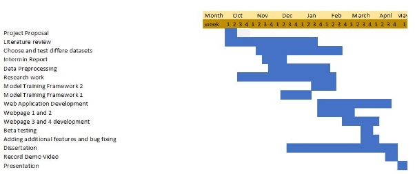

*Figure 5.3.0 Gantt Chart Project Timeline*

5. **References**

References

Arai, K. (2021). *Intelligent systems and applications: Proceedings of the 2021 intelligent*

*systems conference (IntelliSys) volume 1*. Springer Nature.

Carette, R., Cilia, F., Dequen, G., Bosche, J., Guerin, J.-L., & Vandromme, L. (2018).

Automatic autism spectrum disorder detection thanks to eye-tracking and neural network-based approach. In *Internet of Things (IoT) Technologies for HealthCare* (pp. 75–81). Springer International Publishing. http://dx.doi.org/10.1007/978-3-319-76213-5\_11

Carette, R., Elbattah, M., Cilia, F., Dequen, G., Guérin, J.-L., & Bosche, J. (2019). Learning

to Predict Autism Spectrum Disorder based on the Visual Patterns of Eye-tracking Scanpaths. *Proceedings of the 12th International Joint Conference on Biomedical Engineering Systems and Technologies*. http://dx.doi.org/10.5220/0007402601030112

Chita-Tegmark, M. (2016). Attention allocation in ASD: A review and meta-analysis of

eye-tracking studies. *Review Journal of Autism and Developmental Disorders*, *3*(3), 209–223. https://doi.org/10.1007/s40489-016-0077-x

Cortes, C., & Vapnik, V. (1995). Support-vector networks. *Machine Learning*, *20*(3),

273–297. https://doi.org/10.1007/bf00994018

Criminisi, A., & Shotton, J. (2013). Classification forests. In *Decision Forests for Computer*

*Vision and Medical Image Analysis* (pp. 25–45). Springer London. http://dx.doi.org/10.1007/978-1-4471-4929-3\_4

*Figure 4: (A) Architecture of the original VGG16, (B) VGG16 architecture with the strategy*

*applied.* (n.d.). https://doi.org/10.7717/peerj-cs.451/fig-4

Klin, A., Jones, W., Schultz, R., Volkmar, F., & Cohen, D. (2002). Visual fixation patterns

during viewing of naturalistic social situations as predictors of social competence in individuals with autism. *Archives of General Psychiatry*, *59*(9), 809. https://doi.org/10.1001/archpsyc.59.9.809

Nayar, K., Shic, F., Winston, M., & Losh, M. (2022). A constellation of eye-tracking measures

reveals social attention differences in ASD and the broad autism phenotype. *Molecular Autism*, *13*(1). https://doi.org/10.1186/s13229-022-00490-w

Oliveira, J. S., Franco, F. O., Revers, M. C., Silva, A. F., Portolese, J., Brentani, H.,

Machado-Lima, A., & Nunes, F. L. S. (2021). Computer-aided autism diagnosis based on visual attention models using eye tracking. *Scientific Reports*, *11*(1). https://doi.org/10.1038/s41598-021-89023-8

Soloviev, R., Telpukhov, D., Mkrtchan, I., Kustov, A., & Stempkovskiy, A. (2020, March).

Hardware implementation of convolutional neural networks based on Residue Number System. *2020 Moscow Workshop on Electronic and Networking Technologies (MWENT)*. http://dx.doi.org/10.1109/mwent47943.2020.9067498

Tao, Y., & Shyu, M.-L. (2019, July). SP-ASDNet: CNN-LSTM Based ASD Classification

Model using Observer ScanPaths. *2019 IEEE International Conference on Multimedia &amp; Expo Workshops (ICMEW)*. http://dx.doi.org/10.1109/icmew.2019.00124

*WebGazer.js: Democratizing webcam eye tracking on the browser*. (n.d.). Retrieved April 28,

2023, from https://webgazer.cs.brown.edu/

Zhang, Y., Xu, C., Du, R., Kong, Q., Li, D., & Liu, C. (2023). MSIF-MobileNetV3: An improved

MobileNetV3 based on multi-scale information fusion for fish feeding behavior analysis. *Aquacultural Engineering*, *102*, 102338. https://doi.org/10.1016/j.aquaeng.2023.102338

苏庆华. (2022). Brief analysis of resnet50. *Computer Science and Application*, *12*(10),

2233–2236. https://doi.org/10.12677/csa.2022.1210227
